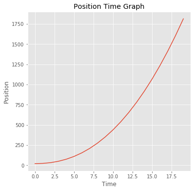
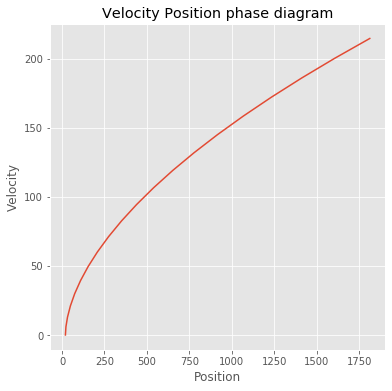
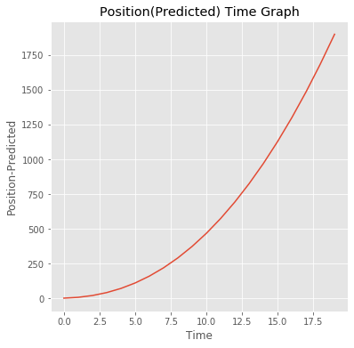

# Generation of Dummy Data


```python
#declaring the libraries

import matplotlib.pyplot as plt
plt.rcParams['figure.figsize'] = [6,6]
```

## Aim is to produce a qualitative x-t graph from a given v-x phase diagram

**first we'll generate some values for x-position, velocity by assigning x as a function of time and v as derivative of x.**


```python
k=2
x=[]
v=[]
t=[]
for n in range(0,20): #linspace to be used 
    x.append(k*pow(n,2.3)+pow(n,1.3)+20)
for n in range(0,20): #linspace to be used 
    v.append(k*pow(n,1.3)*2.3+pow(n,0.3)*1.3)
for n in range(0,20): #linspace to be used 
    t.append(n)
    
print(x)
print(v)
print(t)
```

    [20.0, 23.0, 32.31144413344916, 49.19817257663409, 74.56579639437433, 109.1361128181019, 153.51804903395697, 208.24294606470465, 273.7849736980115, 350.5741296833313, 439.00508614346455, 539.4435126556873, 652.2307698033411, 777.6874993919741, 916.116438743378, 1067.8046720918342, 1233.0254628768685, 1412.039767040463, 1605.0974988812286, 1812.4386017823015]
    [0.0, 5.8999999999999995, 12.92701634012162, 20.994876471770233, 29.859616360254844, 39.38195529963413, 49.470148936940475, 60.058463744453405, 71.09711395510473, 82.54687331858628, 94.375907498028, 106.557779868894, 119.07012831296262, 131.89374989415853, 145.0119458754679, 158.41003967323869, 172.07501357855585, 185.9952293776754, 200.16020969356066, 214.56046420794905]
    [0, 1, 2, 3, 4, 5, 6, 7, 8, 9, 10, 11, 12, 13, 14, 15, 16, 17, 18, 19]
    

### x-t graph


```python
plt.style.use('ggplot')
plt.plot(t,x)

plt.xlabel('Time')
plt.ylabel('Position')
plt.title("Position Time Graph")
plt.show()
```





### phase diagram


```python
plt.plot(x,v)

plt.xlabel('Position')
plt.ylabel('Velocity')
plt.title("Velocity Position phase diagram")
plt.show()
```





```python
step=1.0
x_new=[]
x_new.append(0.0)
for n in range(1,20): #linspace to be used 
    x_new.append(x_new[n-1]+(v[n])*step)

print(x_new)
```

    [0.0, 5.8999999999999995, 18.82701634012162, 39.82189281189186, 69.6815091721467, 109.06346447178083, 158.5336134087213, 218.5920771531747, 289.68919110827943, 372.2360644268657, 466.61197192489374, 573.1697517937878, 692.2398801067504, 824.133630000909, 969.1455758763768, 1127.5556155496156, 1299.6306291281714, 1485.6258585058467, 1685.7860681994075, 1900.3465324073566]
    


```python
plt.plot(t,x_new)

plt.xlabel('Time')
plt.ylabel('Position-Predicted')
plt.title("Position(Predicted) Time Graph")
plt.show()
```




